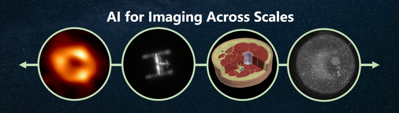

**Welcome to the PKU Computational Scientific Imaging Lab!**

Computational Imaging is a vibrant and rapidly growing research area at the intersection of computer science, physical science, and instrumentation. Our group pioneers the development of advanced algorithms and innovative hardware to facilitate future scientific imaging at extreme scales. Our scope of work extends across multiple scientific disciplines, ranging from biomedicine to physical sciences. Our research is inherently interdisciplinary and our extensive expertise bridges optics, deep learning, computer vision/graphics, statistical inference, and hardware design.

---

We aim to facilitate future scientific imaging at across scales through cutting-edge computational methods.
